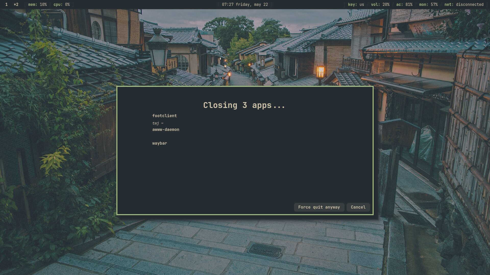

# gtkshutdown

A graceful shutdown utility that closes all apps before exiting.

Currently only supports Hyprland, but I plan to expand support to other Wayland
window managers.



## Why use this?

You may wonder how this differs from just running `systemctl poweroff` in the
terminal. It's important to note that `gtkshutdown` **does not** shut down the
system.

Normally, on shutdown, Linux sends a `SIGTERM` signal to gracefully shut down
all running processes. However, this approach can lead to _losing unsaved work_
and _data corruption_. `gtkshutdown` will instead gracefully close all running apps
via the compositor's IPC, which gives the user a chance to save their work, and
also leads to less data corruption.

## Installation

### Nix

Add the following to `flake.nix`:

```nix
gtkshutdown = {
  url = "github:dastarruer/gtkshutdown";
  inputs.nixpkgs.follows = "nixpkgs";
};
```

Then, in `configuration.nix`, add the following:

```nix
environment.systemPackages = [
  inputs.gtkshutdown.packages.${pkgs.stdenv.system}.default
];

# OR if using home-manager:
home.packages = [
  inputs.gtkshutdown.packages.${pkgs.stdenv.system}.default
];
```

### Other platforms

Download the latest release from the
[GitHub releases page](https://github.com/dastarruer/gtkshutdown/releases).

## Usage

Run `gtkshutdown -h` for a list of options:

```txt
Usage: gtkshutdown [OPTIONS]

Options:
  -d, --dry-run              Whether to only do a dry-run, where apps are not closed but the UI is still shown
  -p, --post-cmd <POST_CMD>  Set a command to be run after all apps have shut down. By default, gtkshutdown runs nothing after exiting
  -h, --help                 Print help
  -V, --version              Print version
```

### Tips

By default, nothing is run after `gtkshutdown` exits. If you want to shutdown,
or reboot, you can instead run:

```sh
# Shut down system
gtkshutdown --post-cmd "shutdown -P 0"

# Reboot system
gtkshutdown --post-cmd "reboot"
```

## Troubleshooting

To run `gtkshutdown` with logs enabled, run:

```sh
RUST_LOG=debug gtkshutdown [OPTIONS]
```

Logs are written to `$XDG_STATE_HOME/gtkshutdown` by default. If `$XDG_STATE_HOME`
is not set, then `gtkshutdown` falls back to `$HOME/.local/state/gtkshutdown`.

Append the output of `cat ~/.local/state/gtkshutdown/gtkshutdown_rCURRENT.log`
to any issues you create to help me figure out what went wrong.
